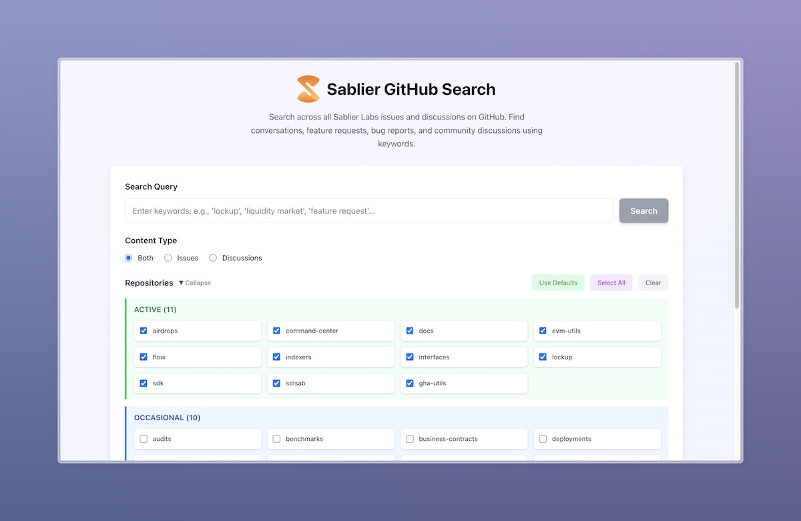

# 🔍 Sablier GitHub Searcher

A Next.js web application that provides a centralized search interface for issues and discussions across all Sablier
Labs repositories. Built with FlexSearch for fast, server-side full-text search via Route Handlers. The GitHub data is
fetched via API and pre-indexed every 3 days.

## ✨ Features

- **🚀 Fast search**: Server-side [FlexSearch](https://github.com/nextapps-de/flexsearch) via Next.js Route Handlers
- **📋 Cross-repository**: Search across all Sablier Labs repositories
- **🏷️ Smart filtering**: Filter by repository tier, content type, and specific repos
- **💬 Comprehensive content**: Search both GitHub issues and discussions
- **📱 Responsive design**: Modern UI with Tailwind CSS

## 🤖 Data Pipeline

GitHub data (issues and discussions) is automatically refreshed every 3 days via GitHub Actions:

- **CLI script**: [`fetch-data.ts`](./cli/fetch-data.ts) fetches all issues and discussions
- **Automation**: [`GitHub Actions workflow`](./.github/workflows/fetch-data.yml) runs the pipeline
- **Storage**: Data is stored in [`github-data.json`](./public/github-data.json) for fast access

## 🚀 Usage

Check out **[github.sablier.com](https://github.sablier.com)**!

## 💁 Contributing

See the [CONTRIBUTING.md](./CONTRIBUTING.md) file.

## 📄 License

[MIT License](./LICENSE) © Sablier Labs
